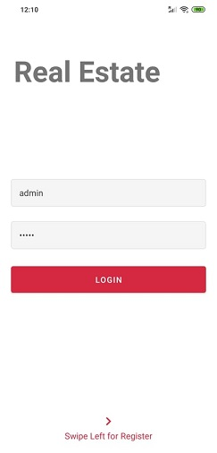
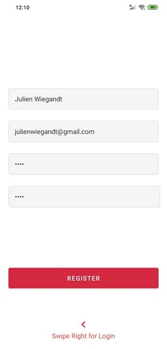
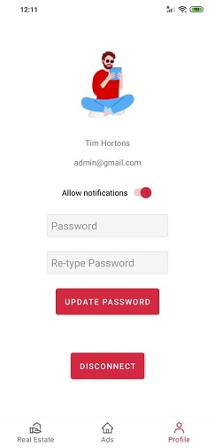
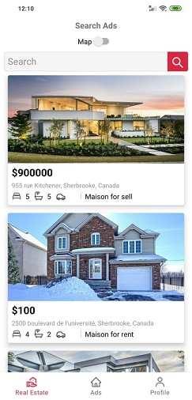
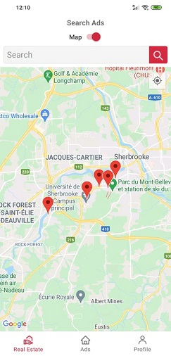
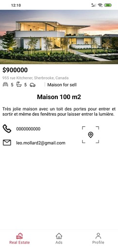
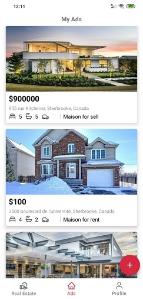
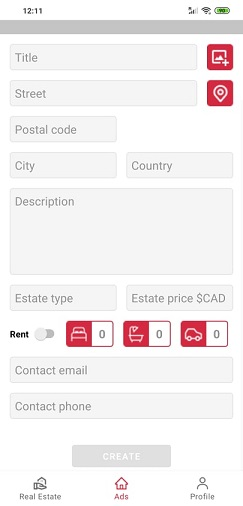

# RealEstate

## Context

Real Estate is a project done in the course 'Application internet et mobilite' at the University of Sherbrooke. Our team is composed of 4 students from Polytech Montpellier, France.

- Anna MASANTE as **Project manager**
- Leo MOLLARD as **Fullstack developer**
- Lilian MISSERE as **Backend developer**
- Julien WIEGANDT as **Frontend developer**

The full project report is available [here](./media/Rapport_RealEstate.pdf).

## Project

RealEstate is an Android application that manages real estate offers. It uses a full REST API with Express.js in the Node.js environment. We use a Postgres database on AWS, a public image storage API 'imgbb', as well as the Google maps API.

The initial UX/UI design figma prototype is available [here](https://www.figma.com/file/LZ1J2uCwb22phhfIlUMrfm/RealEstate?node-id=0%3A1) _(Julien's work)_.

### Connection views

### Ads views

### My ads views

